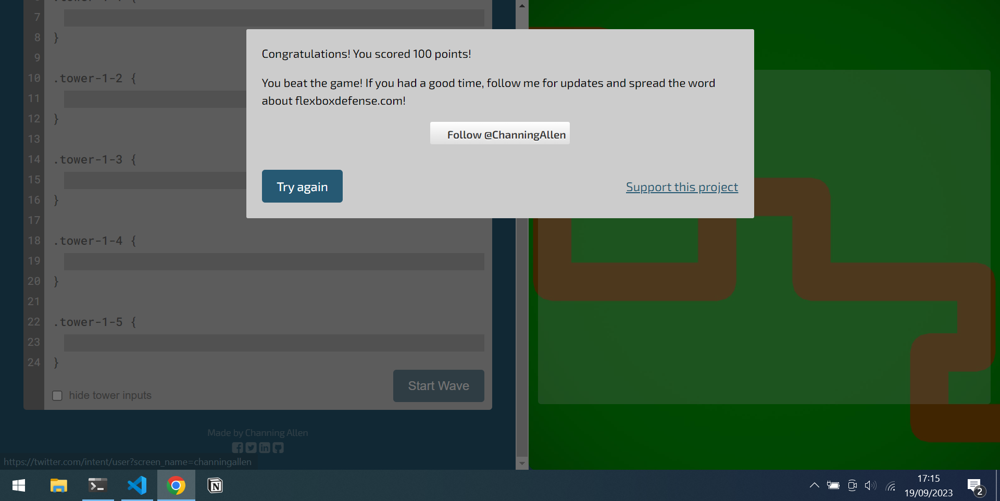

# CSS Exercises  
## Flukeout  
1. plate  
2. bento  
3. #fancy  
4. plate > apple  
5. #fancy > pickle  
6. .small  
7. orange.small  
8. bento > orange.small  
9. plate, bento  
10. *  
11. plate *  
12. plate + apple  
13. bento ~ pickle  
14. plate > apple  
15. plate > orange:first-child  
16. plate > apple:only-child, plate > pickle:only-child   
17. apple.small, pickle.small  
18. plate:nth-child(3)  
19. bento:nth-last-child(3)  
20. apple:first-of-type  
21. plate:nth-of-type(even)  
22. plate:nth-of-type(2n+3)  
23. plate > .small:only-of-type  
24. orange:last-of-type, apple:last-of-type  
25. bento:empty  
26. apple:not(.small)  
27. [for]  
28. plate[for]  
29. bento[for="Vitaly"]  
30. [for^=Sa]  
31. [for$="ato"]  
32. [for*="obb"]  

## Toolness  
1. p  
2. #me  
3. .lol  
4. .lol.wut  
5. p.meh  
6. p, #bop  

## Selectors exercise  
1. ```* {}```  
2. ```p {}```    
3. ```.title-1 {}```  
4. ```.bg-yellow```   
5. ```*[id]```  
6. ```*[id, value="title-1"]```  
7. ```*[href="https://www.yahoo.com"]```  
8. ```*[class^="title"]```   
9. ```*[href$=".com"]```  
10. ```*[class*="title"]```  
11. ```*[href*="127"]```  
12. ```*[href^="http"]```  
13. ```a, p, h1```  
14. ```main > p```  
15. ```h1 +```  
16. ```h1 + *```  
17. ```main:child```  

## Selectors exercise 2  
```* => 0,0,0```  
```.container => 0,1,0```  
```.container href 0,2,0 => ```  
```h1 => 0,0,1```  
```.#title => 1,0,0```  
```.!important => This is a special attribute that only affects the current row, not the selector. !important will allways be priorized.```  

## Flexboxdefense  
1. 